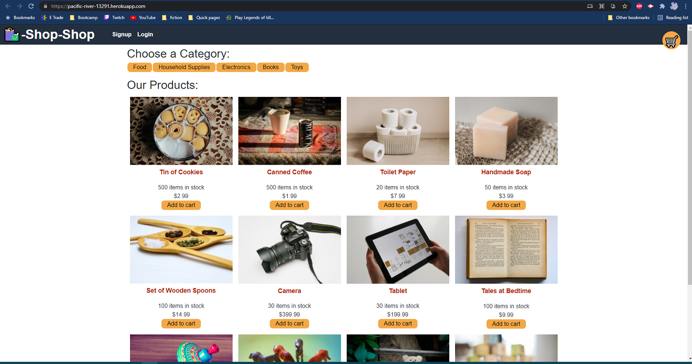

# Full Monty eShop

## Description

This app is a full fledge e commerce website with global state management and stripe integration.

https://pacific-river-13291.herokuapp.com/

## Table of Contents

- [Installation](#installation)
- [Usage](#usage)
- [Credits](#credits)
- [License](#license)

## Installation

To use locally, clone or download the repo. Next, run npm install to download all dependencies, npm run seed to create sample data, and npm run start to host the application on the localhost.

## Usage

You can create an account, login in and log out, and add/remove items and quantities from you cart. You can also filter products by category. All data is tracked in global redux state and is saved in the server.

## License

MIT License

     Copyright (c) [2021]

     Permission is hereby granted, free of charge, to any person obtaining a copy
     of this software and associated documentation files (the "Software"), to deal
     in the Software without restriction, including without limitation the rights
     to use, copy, modify, merge, publish, distribute, sublicense, and/or sell
     copies of the Software, and to permit persons to whom the Software is
     furnished to do so, subject to the following conditions:

     The above copyright notice and this permission notice shall be included in all
     copies or substantial portions of the Software.

     THE SOFTWARE IS PROVIDED "AS IS", WITHOUT WARRANTY OF ANY KIND, EXPRESS OR
     IMPLIED, INCLUDING BUT NOT LIMITED TO THE WARRANTIES OF MERCHANTABILITY,
     FITNESS FOR A PARTICULAR PURPOSE AND NONINFRINGEMENT. IN NO EVENT SHALL THE
     AUTHORS OR COPYRIGHT HOLDERS BE LIABLE FOR ANY CLAIM, DAMAGES OR OTHER
     LIABILITY, WHETHER IN AN ACTION OF CONTRACT, TORT OR OTHERWISE, ARISING FROM,
     OUT OF OR IN CONNECTION WITH THE SOFTWARE OR THE USE OR OTHER DEALINGS IN THE
     SOFTWARE.

## Badges

## Questions

You can reach me here with any questions:

https://github.com/Joshuawd190

joshuawd190@gmail.com
